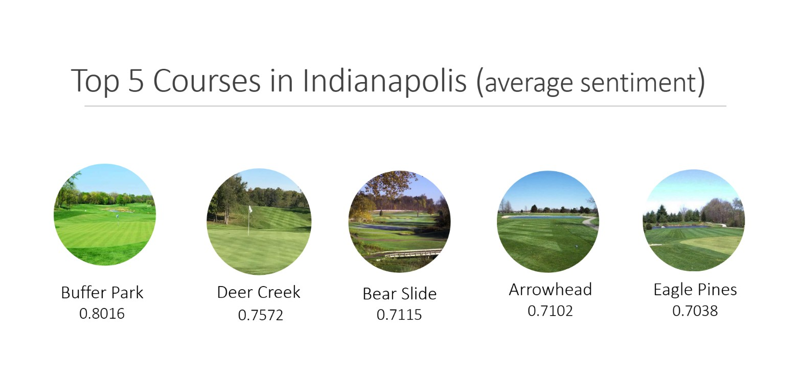

# Exploring Consumer Tastes and Preferences in Indianapolis Golf Courses through Sentiment-Based Review Analysis

This project analyzes over 6,300 golfer reviews from GolfPass to uncover key themes and preferences that influence course ratings and customer satisfaction. Using natural language processing techniques, I explored what matters most to players — such as bunker conditions, staff interactions, pace of play, and course maintenance. The analysis was conducted using Python, VADER sentiment scoring, and BERTopic, and it was completed as my final project for the MSBA Unstructured Data Analytics course at the University of Notre Dame.

## View the Report

You can view the full HTML report here:  
📄 [Golf Course Review Analysis Report](https://aheck3.github.io/golf-course-review-analysis/golf-course-review-report.html)


## Background

Growing up on the Southside of Indianapolis, I’ve played dozens of courses in the area — from public courses to semi-private clubs. I’ve always been curious about what makes certain courses more enjoyable than others, and what specific elements drive a golfer to leave a positive or negative review.

GolfPass offers thousands of player reviews that go far beyond star ratings, providing rich comment data on personal experiences. By analyzing this unstructured text feedback, I hoped to merge my business acumen with my knowledge and passion for golf to help courses better understand their customers and improve the on-course experience. My goal was to identify what golfers truly value — and how courses can use those insights to strengthen their brand, boost customer satisfaction, and drive long-term success.

## Objective

The goal of this project was to uncover what golfers truly care about when it comes to the courses they play. I hoped to gain insights into the factors that influence how players rate and review a course — from conditions and design to staff interactions and pace of play. By identifying the common themes in player feedback, I aimed to highlight what enhances the overall experience and what detracts from it.

Key research questions included:

What aspects of a course do golfers consistently mention in their reviews?

What do players value most, and what frustrates them when they reflect on a round?

How do sentiment trends vary across different courses in the Indianapolis area?

I believe this type of analysis has real-world applications. If a course can identify where golfers derive the most value, they can focus efforts on those areas to elevate the player experience. In turn, this can lead to stronger customer satisfaction, better public perception, and ultimately, increased revenue.

## Data

All reviews were scraped from GolfPass, a site affiliated with Golf Channel and NBC Sports. I focused on the Indianapolis region and collected:

- Course names and unique URLs  
- Over 6,300 user-submitted review comments from 45+ courses  

The data was cleaned, de-duplicated, and filtered to retain only courses with at least 20 reviews. The final dataset included 6,300+ comments.

### 📥 Step 1: Scraping Course Names and Unique IDs from URLs.

```python
import pandas as pd
import numpy as np
from bs4 import BeautifulSoup 
import requests
import re

base_url = "https://www.golfpass.com/"
top_courses = 'https://www.golfpass.com/travel-advisor/destinations/57-indianapolis-in/'
top_courses_req = requests.get(top_courses)
top_courses_soup = BeautifulSoup(top_courses_req.text, 'html.parser')

links_class = top_courses_soup.select('a.Link')

golfcourses = []

for link in links_class:
    href = link.get('href')
    if '/courses/' in href:
        find = re.search(r'/courses/([^/]+)/', href)
        if find:
            uniqueID = find.group(1)
        else:
            continue
        course_complete_name = link.get_text().strip()
        if not course_complete_name or "Write Review" in course_complete_name:
            continue
        golfcourses.append({'course_name': course_complete_name, 'unique_identifier': uniqueID})

golfcourses_df = pd.DataFrame(golfcourses)

golfcourses_df = golfcourses_df[['course_name', 'unique_identifier']].drop_duplicates().reset_index(drop=True)

golfcourses_df.head()

# This line of code outputs the dataframe to a .csv to store locally.
golfcourses_df.to_csv('golfcourseslistIndianapolis.csv', index=False) 
golfcourses_df = pd.read_csv('golfcourseslistIndianapolis.csv')

```

### 📥 Step 2: Scraping Review Comments using unique IDs

```python
course_reviews_list = []

for uniqid, course in golfcourses_df.iterrows():
    course_name = course['course_name']
    course_id = course['unique_identifier']

    for number in range (1, 16, 1):
        course_comments_url = f"https://www.golfpass.com/travel-advisor/courses/{course_id}?page={number}"
        course_comments_req = requests.get(course_comments_url)
        course_comments_soup = BeautifulSoup(course_comments_req.text, 'html.parser')

        comment_text = course_comments_soup.select('.ReviewItem-description p')

        for comment in comment_text:
            try:
                review_text = comment.get_text().strip()
                if review_text:
                    course_reviews_list.append({
                        'course_name': course_name,
                        'unique_identifier': course_id,
                        'comment': review_text
                    })
            except IndexError:
                continue

course_reviews_df = pd.DataFrame(course_reviews_list)

## Again, this code chunk takes a while to run so the below lines of code allow the dataframe to be stored locally. This will save you time.
course_reviews_df = pd.read_csv('course_reviews_Indianapolis.csv')
course_reviews_df = course_reviews_df.drop_duplicates(subset = ['comment']).reset_index(drop=True)


```

### 📥 Step 3: Filtering and Cleaning

```python
# I removed the duplicate comments and filtered the datset to only include courses with more than 20 reviews. This is simply the number I selected, it can be adjusted for the scope of analysis. 
course_reviews_df = pd.read_csv('course_reviews_Indianapolis.csv')
course_reviews_df = course_reviews_df.drop_duplicates(subset='comment').reset_index(drop=True)

# Filter for courses with sufficient data
course_reviews_df['count'] = course_reviews_df.groupby('course_name')['comment'].transform('count')
course_reviews_df = course_reviews_df[course_reviews_df['count'] > 20]

```

## Methodology

- **Web Scraping**: Used BeautifulSoup to scrape course names and review text  
- **Sentiment Analysis**: Applied VADER to assign a sentiment score (-1 to +1) to each comment  
- **Topic Modeling**: Used BERTopic with a custom TF-IDF transformer to extract and group common themes from reviews  

Three topic models were developed:
- One covering all Indianapolis reviews  
- One focused specifically on my home course, The Legends Golf Club  
- One filtered to only include neutral or negative sentiment reviews (≤ 0.10 compound score)

## Results

Across all reviews, several themes emerged consistently:

- Bunkers and sand conditions (often cited as unplayable)
- Pace of play (especially during peak hours)
- Friendliness and professionalism of course staff
- Course wetness and drainage (especially after rain)

### Top 5 Courses by Sentiment

The courses with the highest average sentiment scores were:
1. Buffer Park Golf Course  
2. Deer Creek Golf Club  
3. Bear Slide Golf Club  
4. Arrowhead Golf Course  
5. Eagle Pines Golf Club  



<p align="center"><em>Figure: Top 5 Courses in Indianapolis by Sentiment Score</em></p>


## Conclusion

This project shows that golfers care deeply about factors that go beyond just layout and design. Maintenance, friendliness of staff, pace of play, and even bunker conditions are consistent drivers of satisfaction or frustration.

For public and semi-private courses hoping to improve reputation and increase revenue, these insights can directly inform operations and staffing decisions. Reviewing and acting on golfer feedback can lead to improved ratings, stronger customer loyalty, and increased demand.

## Reproducibility

This analysis can be applied to any other region by simply updating the GolfPass region URL. For example, in the scraping step:

```python
top_courses = 'https://www.golfpass.com/travel-advisor/destinations/57-indianapolis-in/'
```

To analyze courses in Tampa, Orlando, or any other area, replace that URL with the correct destination link from the GolfPass “Travel” section. The rest of the scraping and analysis pipeline will adjust accordingly.

## Files Included

- `golf-course-review-analysis.qmd`: Quarto source file  
- `golf-course-review-report.html`: Final rendered report  
- `golf-course-review-presentation.pdf`: Presentation slides  
- `data/`: Raw CSVs with course names and reviews  

## Author

Alex S. Heck  
MSBA, University of Notre Dame  
GitHub: [@aheck3](https://github.com/aheck3)
